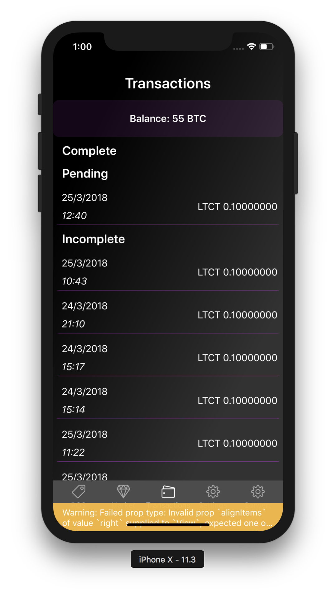
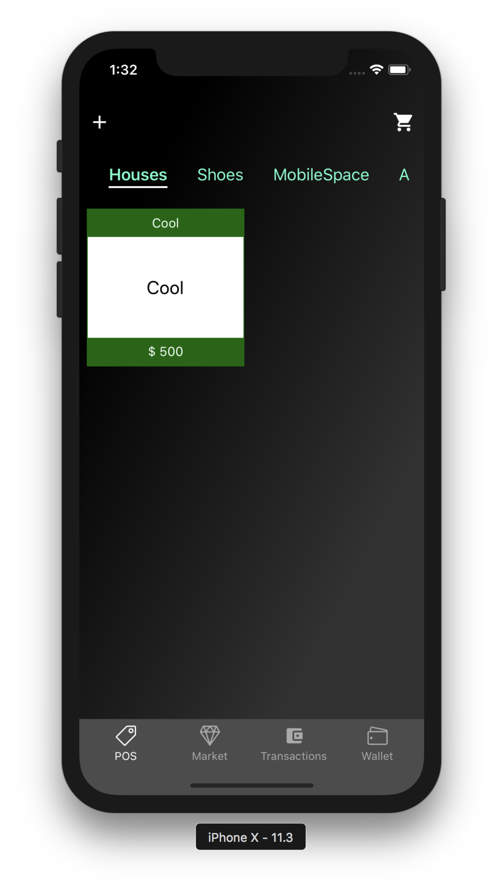
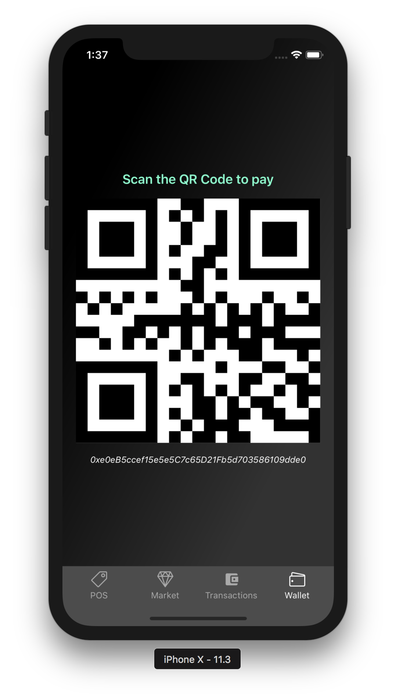
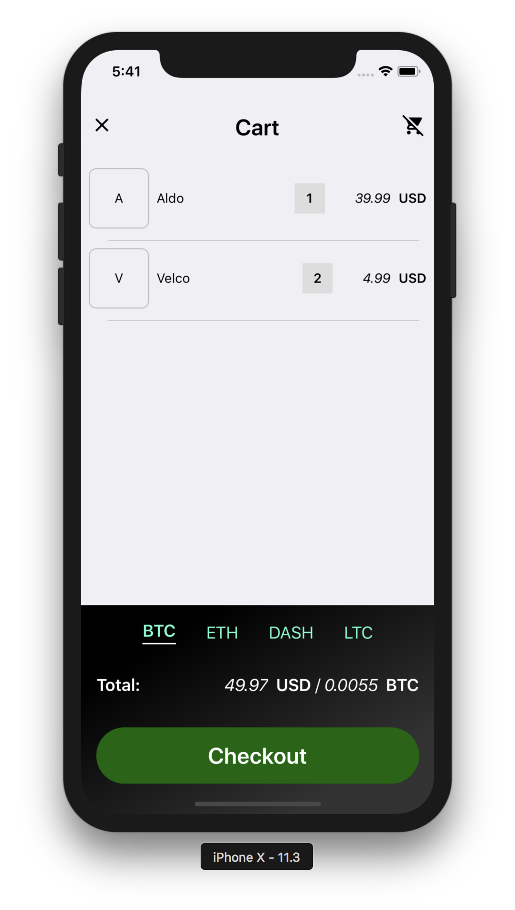
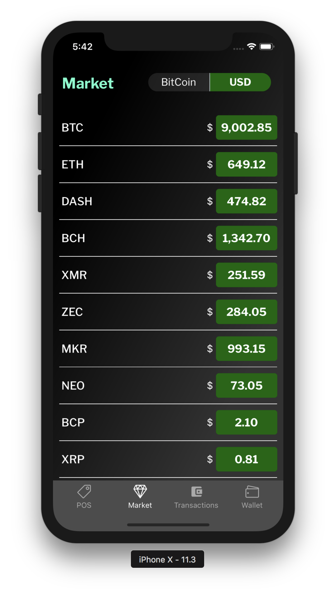
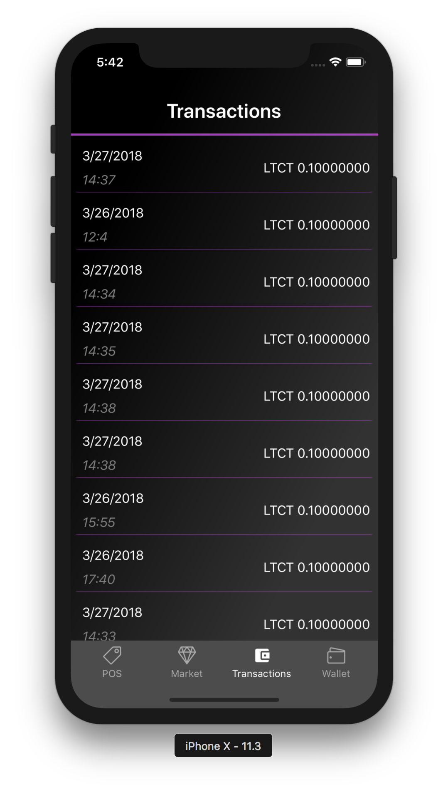
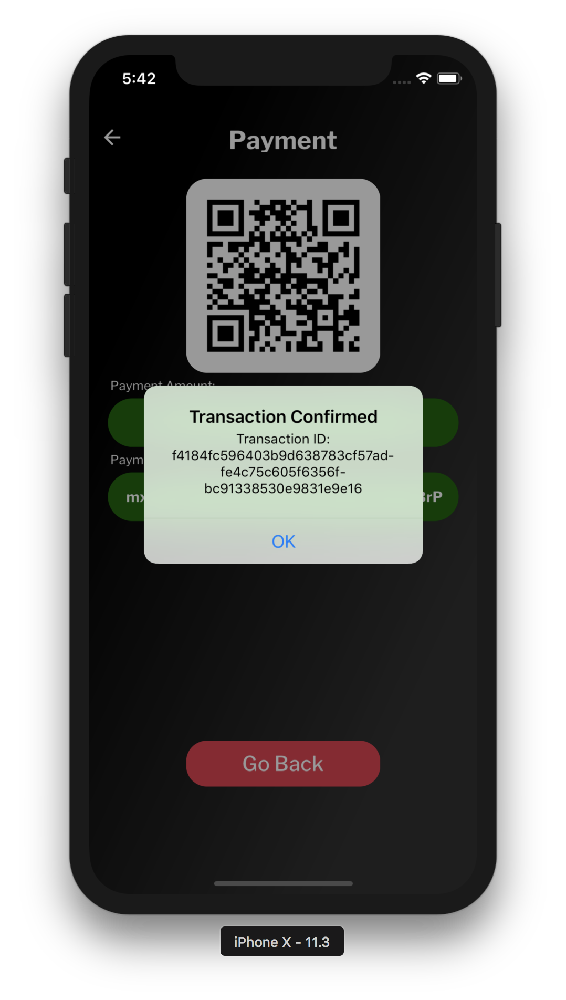

<p align="center">
<a href="https://github.com/mobile-space/crypto-pos">

</a>
</p>

<h1 align="center">
Spiral
</h1>
<p align="center">
Payments can be completed using cryptocurrency
</p>

<br>

## What's Spiral and why did we build it? 🤔

## This application was made to inspire local businesses!

- As we are making transition to currency 2.0 (i.e) Digital cash, we personally believe that something needs to changed!
- Profit margin need to be increased so that local businesses can save up more
- We wanted to cut off middle man(BANK)! Therefore, we made it peer-to-peer instantaneous transaction
- We completely eliminated bank fees and the hardware use(credit card swiper, wires, and other electronics)

### What can user do by using Spiral

- User can insert items in the system; **categories**, **item name**, and **price tag** on dashboard
- User can edit or clear items from their **cart**
- User can use the form of Payments, Bitcoin options available
- Check the live crypto market price
- Use would have to scan the QR Code to submit transaction
- User can view **Transactions** history (**_complete,incomplete, and pending_**).

### API's Used

- Precision transaction was made by calculating the payments with latest crypto price; [CryptoCompare](https://www.cryptocompare.com/)

### Technology Stack

- DB: **Postgresql**
- Server: **Express.js**
- **Node.js**
- Framework: **React Native**
- State Management: **Redux**

## Getting Started

```
git@github.com:mobile-space/spiral.git

exp start

npm install

exp ios (iOS version)

exp android (Android version)
```
### [Demo - Try it on Expo](https://exp.host/@mitulsavani/spiral)

## Screens

|                                                         |                                                         |                                                         |
| :-----------------------------------------------------: | :-----------------------------------------------------: | :-----------------------------------------------------: |
|  |  |  |
|  |  |  |
|  |  |  |

## Feedback

For any other questions about this repo in general please reach out to [**@mitulsavani**](https://github.com/mitulsavani), [**@ryanliszewski**](https://github.com/ryanliszewski), [**thomashzhu**](https://github.com/thomashzhu) on Github. <br>
PS: Feel free to fork it if you find our app interesting.

> Thanks
